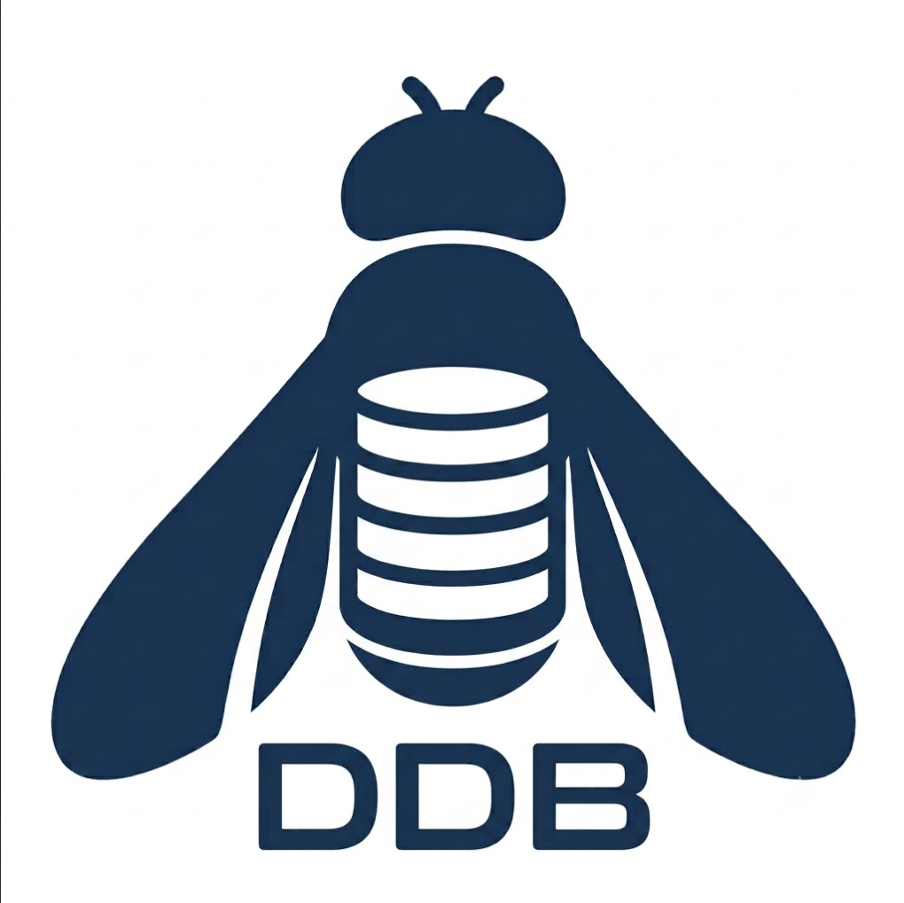

<p align="center">
  
</p>

# DDB — Drosophila Vial Tracking System

[](https://github.com/zerotonin/drosodb/actions/workflows/ci.yml)
[](https://zerotonin.github.io/drosodb/)
[](https://github.com/astral-sh/ruff)
[](https://www.python.org/)

Small-lab system for tracking *Drosophila* vials with QR-coded labels,
printer-driven workflow, lineage across flips and crosses, and an auditable
history. Runs single-user out of the box and scales to a shared bench tablet
with one SQLite file — not a multi-user SaaS.

## What it does

- **Create vials** with a compact QR label printed on a Brother QL-820NWB
  (17 × 54 mm DK-11204), one click from genotype + owner + org-unit.
- **Scan vials** via USB webcam in the Scan tab; decoded payloads fetch
  the full detail panel (genotype notation, audit trail, lineage).
- **Flip, multiply, decommission, reactivate** vials with audit-logged
  state transitions. `Multiply…` splits one parent into 2–12 children in
  one click; `Reactivate` undoes accidental decommissions (with a warning
  when active flip-descendants would create a forked lineage).
- **Flip all active vials of a genotype** in one click (Genotypes tab →
  `Flip all active…`). Every currently-active vial of the chosen strain
  is decommissioned and gets one successor + label in a single
  transaction; the last-used genotype is pre-selected so a repeat cycle
  (e.g. weekly dark-flies flip) is one motion.
- **Auditory scan confirmation**: a short chirp plays on every successful
  QR decode (PipeWire/PulseAudio/ALSA player ladder; mute via
  `DDB_SCAN_SOUND=0`).
- **Live font-size adjuster**: scale every label and dialog in the GUI on
  the fly. Settings tab → "Font size" slider, or keyboard shortcuts
  `Ctrl+=` (bigger), `Ctrl+-` (smaller), `Ctrl+0` (reset). Persists to
  `DDB_GUI_FONT_SCALE`, clamped to 0.7×–2.0×.
- **Import genotypes by stock-center ID** (Bloomington, Vienna/VDRC,
  Kyoto/DGGR, NIG-Fly, KDRC, FlyORF, NDSSC) from a locally-cached
  FlyBase catalog — no per-import web calls.
- **Reports** tab: search/filter by genotype, owner, org-unit, donor,
  generation; export lineage as CSV.
- **Biosafety PDF report**: one-click PDF for institutional filings.
  Snapshot counts (active / decommissioned vials, in-stock / dropped
  genotypes), in-period activity (creates, flips, decommissions,
  reactivations), per-owner active-vial breakdown, signature block,
  and a full active-genotype annex. CLI takes `--annual YYYY`,
  `--from`, `--to`, `--org-unit`, `--owner`.
- **Auditable**: every mutation writes an `AuditEvent` with actor, action,
  and before/after payload.
- **Typer CLI** mirrors the GUI for scripted workflows (`ddb vial create`,
  `ddb vial flip`, `ddb printer status`, etc.).

## Quickstart

Two paths — pick whichever fits.

**A. Per-user install (no sudo — recommended on shared tablets).** One
line clones the repo, creates the conda env, installs the package, and
drops a launcher on your Desktop:

```bash
curl -sSL \
  https://raw.githubusercontent.com/zerotonin/drosodb/main/scripts/install_user.sh \
  | bash
```

You still need conda installed under your account first; the script
prints the exact miniforge one-liner if it can't find one. Re-running
the script updates the env and refreshes the launcher.

**B. Manual install** if you're doing something custom:

```bash
# one-time
conda env create -f environment.yml
conda activate ddb
pip install -e ".[gui,hardware,dev]"

# initialise the SQLite DB
ddb init-db

# launch the GUI
ddb gui
```

Run the tests to confirm the install:

```bash
pytest     # ~238 tests, ~10 s
```

## Multi-user on one tablet

DDB can run on a shared bench tablet where every biologist has their
own Linux account. The DB, label PNGs, and everything else live in a
world-reachable directory (`/srv/ddb/`), the SQLite file uses WAL mode
so two people can use the GUI at the same time without lock storms,
and every mutation is audited to the OS user who made it — no login
prompt, no passwords to manage.

Setup on the tablet (once):

```bash
# 1. Create the shared directory + `ddb` group and set the perms.
sudo bash scripts/setup_shared_sqlite.sh

# 2. Add each biologist to the `ddb` group.
sudo usermod -aG ddb alice
sudo usermod -aG ddb bob
# ... they need to log out and back in.

# 3. Point DDB at the shared paths.
cp local_paths.template.json local_paths.json
# then edit local_paths.json → "active_profile": "shared_tablet"

# 4. Run the migrations against the shared file.
DDB_DATABASE_URL=sqlite:////srv/ddb/ddb.sqlite3 alembic upgrade head
```

From that point on, launching `ddb gui` from any of the tablet accounts
just works. The bottom-right of the status bar shows `Signed in as:
<username> · profile: shared_tablet` so nobody wonders whose audit
trail they're about to write into. First launch for a new username
auto-creates a DDB `User` row (username = Linux username, full name
blank — anyone can fill it in from the Settings tab).

Path resolution — everywhere DDB reads the DB URL or data directory,
the order is:

1. Env var (`DDB_DATABASE_URL`, `DDB_DATA_DIR`) — one-off override.
2. Active profile in `local_paths.json` — per-machine.
3. In-repo default (`ddb.sqlite3` next to the checkout, `./data/` for
   labels) — the single-user case.

`local_paths.json` is gitignored; the committed template
`local_paths.template.json` documents both the `local` and
`shared_tablet` profile shapes.

Not (yet) supported: a shared-account mode with per-user passwords.
The plan when a lab wants that is a Settings toggle that swaps the
OS-user resolver for a startup login dialog. Filed as a follow-up.

### Offline env pack (fast tablet onboarding)

conda-forge downloads through the campus link comfortably handle one
install at a time — a second tablet user starting `install_user.sh`
while user #1 is still pulling packages drops both streams to
~100 KB/s. To skip the conda download entirely on user #2 and beyond,
snapshot a working env once and let subsequent installs untar it:

```bash
# One-time, from any account that has a working `ddb` conda env:
bash scripts/pack_env.sh
# → produces /srv/ddb/env-packs/ddb-env.tar.gz  (~200 MB)
```

From that point on, `install_user.sh` looks for a pack in this order:
1. `$DDB_ENV_PACK` env-var override.
2. `/srv/ddb/env-packs/ddb-env.tar.gz` (created by the setup script).
3. `~/ddb-env.tar.gz` (per-user fallback if you copied one by hand).
4. Fresh conda/mamba install from the network (previous behaviour).

When a pack is found the env is untarred + `conda-unpack`-ed in seconds
— no channel indexes, no package downloads. Ship a new pack whenever
`environment.yml` changes.

### Per-user printer access

If the tablet has a Bluetooth label printer, every user needs two
extras on top of what `install_user.sh` provisions:

```bash
# 1. Bluetooth group membership — required for BlueZ socket access.
#    Takes effect on their next login.
sudo usermod -aG bluetooth <user>

# 2. Printer settings written into their per-user .env — reuses the
#    tablet's MAC / model / label size (defined in the script).
sudo bash scripts/write_user_printer_env.sh <user1> <user2> …
# → with no args, defaults to the current tablet's user list.
```

Without step 1 BlueZ refuses the RFCOMM socket; without step 2 the
GUI's Print button stays greyed out (`settings.printer_enabled`
defaults to `False`). The `.env` script is idempotent — it diffs
against the existing file and only rewrites when the content differs.
Have each affected user close and reopen the GUI so pydantic re-reads
`.env` at process startup.

Longer-term this per-user duplication should move to a shared file
in `/etc/ddb/`, the way the backup config already does — filed as a
follow-up.

## Hardware supported

| Device       | Model               | Transport                | Notes                                  |
|--------------|---------------------|--------------------------|----------------------------------------|
| Label printer| Brother QL-820NWB   | Bluetooth RFCOMM (ch 1)  | Also: TCP :9100 (network) or file dump |
| QR camera    | any V4L2 webcam     | OpenCV (libv4l)          | zxing-cpp primary, OpenCV fallback     |
| OS           | Linux 6.x (tested)  | BlueZ 5.72+              | macOS / Windows untested               |

## Configuration

Everything is controlled via `.env` in the project root (or `DDB_*`
environment variables). The most common knobs:

```env
# Printer
DDB_PRINTER_ENABLED=1
DDB_PRINTER_BACKEND=bluetooth       # or "network" or "file"
DDB_PRINTER_BLUETOOTH_MAC=AC:4D:16:EB:B6:44
DDB_PRINTER_AUTO_PRINT=1

# Scanner / camera defaults
DDB_DEFAULT_CAMERA_ROLE=back        # or "front"
DDB_SCAN_SOUND=1                    # audible 1-Up chirp on every QR decode

# GUI tweaks
DDB_GUI_FONT_SCALE=1.00             # 0.7-2.0; live via Ctrl+=/Ctrl+-/Ctrl+0

# FlyBase genotype-import catalog
DDB_FLYBASE_ENABLED=1
DDB_FLYBASE_REFRESH_MODE=monthly    # "manual", "weekly", "monthly"

# Stock-keeper defaults for the New-Vial dialog
DDB_DEFAULT_ORG_UNIT=Geurten lab stock
DDB_DEFAULT_OWNER_USERNAME=stockkeeper
```

See `src/ddb/config.py` for the full set — every field is overridable
via `DDB_<UPPERCASE_NAME>`.

## Layout

```
assets/
  ddb_logo.png  app icon (also used by the .desktop launcher, README, docs)
src/ddb/
  models/       SQLModel ORM (Vial, Genotype, Donor, OrgUnit, User, AuditEvent, …)
  workflows/    transaction-safe mutations with audit (create/flip/decommission,
                drop/reactivate genotype)
  printing/     raster pipeline + backends (bluetooth / network / file) +
                bt_recovery helpers + _sidecars scripts
  scanner/      QR decode (zxing + OpenCV fallback), payload parser,
                DB lookup by print-code or FBst
  camera/       V4L2 enumeration, role assignment, preview capture
  biosec/       biosafety PDF reports — data gatherer (pure SQL) +
                reportlab renderer; entry point: `ddb report biosec`
  flybase/      local FlyBase stocks-catalog cache (download, lookup,
                genotype parser, refresh scheduler, collection→donor mapping)
  gui/          PySide6: Scan / Reports / Genotypes / Settings tabs,
                dialogs (CreateVial, CreateGenotype, ImportGenotype,
                PrinterReconnect, FlybaseDownload), shared widgets
                (GenotypeForm, CameraWidget, PrinterStatusLight)
  importers/    FlyStockTable CSV importer
  cli.py        typer CLI entry point
  config.py     pydantic-settings (env-driven)
  db.py         engine + session factory
  labels.py     17×54mm label rendering with QR
  qr.py         compact "DDB:<code>" payload + PNG builder
  lineage.py    vial lineage graph + CSV export
  reports.py    search + detail queries
tests/          ~238 unit + integration tests
alembic/        SQLite migrations
docs/           design docs + operations walkthrough
```

## CLI reference (selected)

```bash
ddb init-db                          # create tables (Alembic)
ddb gui                              # launch the PySide6 desktop app
ddb scan --role back                 # stand-alone scanner loop
ddb seed-demo                        # populate a demo DB

ddb vial create --genotype-id 12 --owner-id 3
ddb vial search --genotype rutabaga --active
ddb vial show <PRINT_CODE>
ddb vial flip <PRINT_CODE>           # creates a child vial, audits both
ddb vial decommission <PRINT_CODE> --reason contaminated
ddb vial lineage <PRINT_CODE> --csv lineage.csv

ddb import-genotypes path/to/FlyStockTable.csv
ddb printer status                   # ESC i S probe via configured backend
ddb printer print-png path/to/label.png

ddb report biosec report.pdf                       # rolling 3 months, whole DB
ddb report biosec report.pdf --annual 2025         # full calendar year
ddb report biosec lab_a.pdf --org-unit "Lab A"     # one lab only
```

Run `ddb --help` or `ddb <subcommand> --help` for the full set.

## Further reading

- `docs/droso_db_project_extended.md` — full design spec.
- `docs/operations.md` — manual reprint + backup walkthrough.
- `docs/index.md` — docs landing page (published at
  [zerotonin.github.io/drosodb](https://zerotonin.github.io/drosodb/)).
